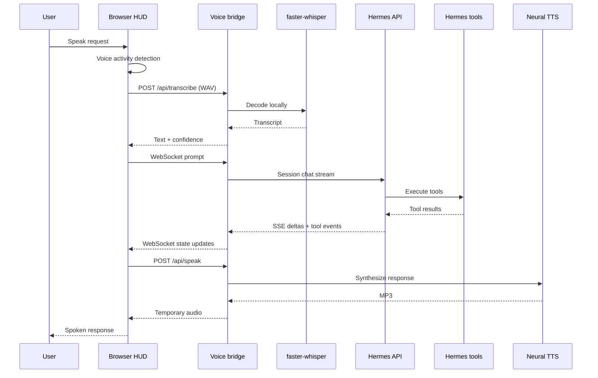
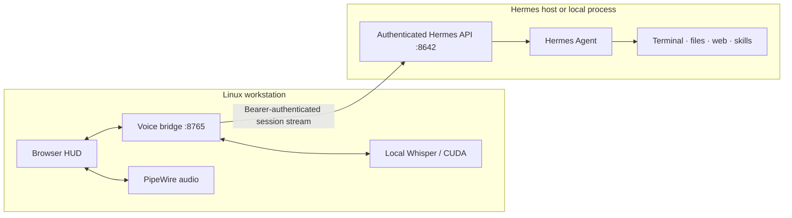

# Architecture

Hermes Voice Core is a thin local interaction layer. It owns microphone capture, speech recognition, state visualization, and speech playback; Hermes remains the agent runtime and source of tool execution.

## Request path



## Components

### Browser HUD

The static HTML, CSS, and JavaScript under `hermes_voice/static/` provide:

- WebSocket connection and session state
- microphone access through `getUserMedia`
- in-browser energy-based voice activity detection
- WAV encoding without an additional browser library
- streamed transcript and tool-progress rendering
- audio playback and state-reactive animation

The browser never receives the Hermes API key.

### Voice bridge

`hermes_voice.app` is a FastAPI service bound to loopback by the supplied systemd unit. It exposes:

| Endpoint | Purpose |
|---|---|
| `GET /` | Serve the HUD. |
| `GET /api/health` | Report bridge, Hermes, voice, and Whisper status. |
| `POST /api/transcribe` | Accept an audio upload and return local transcription. |
| `POST /api/speak` | Synthesize a bounded spoken response. |
| `WS /ws` | Create a Hermes session and relay streamed events. |

Temporary transcription and TTS files are removed after use.

### Speech recognition

The default `distil-large-v3` model is loaded lazily and retained in process memory. GPU initialization uses the configured CUDA compute type. If GPU model construction fails, the service falls back to CPU `int8`; runtime CUDA library failures after construction still surface as transcription errors and should be corrected in the service library path.

### Hermes session stream

Each browser connection creates a uniquely titled Hermes API session. Prompts use:

```text
POST /api/sessions/{session_id}/chat/stream
```

The bridge parses server-sent events and forwards their names and payloads over the browser WebSocket. Important events are:

- `assistant.delta`
- `tool.started`
- `tool.completed`
- `tool.failed`
- `assistant.completed`
- `run.completed`
- `run.failed`

### Speech synthesis

Completed assistant text is converted from visual Markdown to natural speech and limited to 3,500 characters before synthesis. Headings, list markers, formatting punctuation, raw URLs, and fenced code are cleaned without changing the written transcript. The default voice is `en-GB-RyanNeural` with a slightly slower rate and lower pitch. The generated MP3 is deleted by a response background task after delivery.

Playback is interruptible in the browser. Voice on/off and typed-command history are browser-local preferences; starting a new conversation requests a new session from the bridge.

## Trust boundaries



!!! danger "The Hermes key crosses a high-trust boundary"
    Anyone who can read the bridge environment file can invoke the configured Hermes API and its tools. Protect the file, bind services narrowly, and do not expose the bridge as a public unauthenticated web application.

## Failure behavior

- Browser disconnects stop event forwarding without crashing the service.
- Hermes HTTP errors are converted into an `error` WebSocket event.
- Empty or extremely short audio uploads are rejected.
- Failed GPU initialization attempts CPU transcription.
- TTS provider failures return HTTP 502 and leave the written response visible in the transcript.
