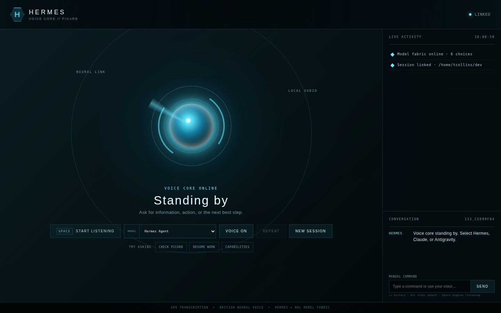

# Get started

This guide takes the shortest path from a running installation to a spoken Hermes response.

## Prerequisites

- Linux with PipeWire or another browser-compatible audio stack
- Google Chrome or Chromium
- Python 3.11 or newer
- [`uv`](https://docs.astral.sh/uv/)
- A running Hermes API server with an API key
- Optional but recommended: NVIDIA GPU with CUDA 12 libraries

## 1. Install the environment

From the project root:

```bash
uv sync --extra test --extra docs
```

This creates an isolated environment containing the application, test suite, and documentation toolchain.

## 2. Configure the bridge

Create a private environment file:

```bash
install -d -m 700 ~/.config/hermes-voice
install -m 600 /dev/null ~/.config/hermes-voice/environment
```

Add the required values:

```dotenv title="~/.config/hermes-voice/environment"
HERMES_API_URL=http://127.0.0.1:8642
HERMES_API_KEY=replace-with-your-api-server-key
HAL_API_URL=http://10.0.0.113:8091
HAL_API_KEY=replace-with-your-hal-assistant-key
WHISPER_MODEL=distil-large-v3
WHISPER_DEVICE=cuda
WHISPER_COMPUTE_TYPE=float16
HERMES_VOICE=en-GB-RyanNeural
HERMES_WORKSPACE=/home/you/dev
```

!!! warning "Keep the API key private"
    The Hermes API exposes agent tools, including terminal and file operations. Keep the key in a mode-`600` environment file and keep the API bound to a trusted interface.

## 3. Start the service

=== "Foreground"

    ```bash
    set -a
    source ~/.config/hermes-voice/environment
    set +a
    uv run uvicorn hermes_voice.app:app --host 127.0.0.1 --port 8765
    ```

=== "systemd user service"

    ```bash
    install -D -m 644 deploy/hermes-voice.service \
      ~/.config/systemd/user/hermes-voice.service
    systemctl --user daemon-reload
    systemctl --user enable --now hermes-voice.service
    ```

Check both the voice bridge and Hermes:

```bash
curl --fail --silent http://127.0.0.1:8765/api/health | python -m json.tool
```

A healthy response reports `"status": "ok"`, the selected voice, and Whisper model/device.

## 4. Open the console

Use the installed desktop launcher or open the app window directly:

```bash
google-chrome \
  --app=http://127.0.0.1:8765 \
  --start-maximized \
  --class=HermesVoiceCore
```

<div class="screenshot-frame" markdown>
[](assets/screenshots/voice-core-overview.png)
</div>
<p class="screenshot-caption">Wait for LINKED in the upper-right and VOICE CORE ONLINE above the main status.</p>

## 5. Authorize the microphone

1. Click the central core or press ++space++.
2. Chrome asks for microphone access the first time; choose **Allow**.
3. Speak a complete request.
4. Stop speaking naturally. The listener finalizes the utterance after sustained silence.

A successful cycle is:

```text
LISTENING → TRANSCRIBING → THINKING / WORKING → SPEAKING → LISTENING
```

!!! tip "First transcription is slower"
    The Whisper model is loaded lazily. The first request may download model data and allocate GPU memory; later requests reuse the loaded model.

## 6. Confirm the deployment

```bash
systemctl --user is-active hermes-voice.service
curl --fail http://127.0.0.1:8765/api/health
```

For GPU mode, make one transcription and then inspect active compute processes:

```bash
nvidia-smi --query-compute-apps=pid,process_name,used_memory --format=csv
```

Continue with [Use the interface](interface.md).
