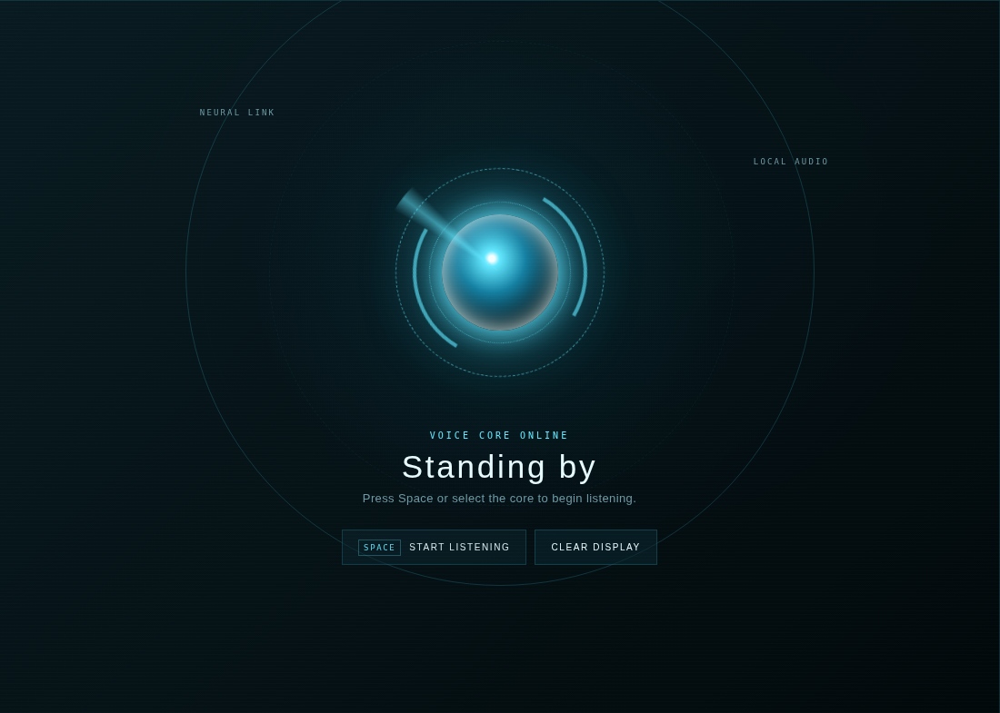
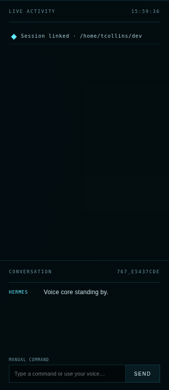

# Use the interface

The UI is organized as a command surface, not a chat application with voice added later.

## Interface anatomy

| Area | Purpose |
|---|---|
| **Link indicator** | `LINKED` confirms that the browser WebSocket is attached to the local bridge. |
| **Central core** | Starts or stops listening and changes appearance with pipeline state. |
| **State copy** | Names the current state and tells you what the system expects next. |
| **Live Activity** | Shows session attachment and real Hermes tool starts/completions. |
| **Conversation** | Displays your transcribed request and the streamed Hermes response. |
| **Manual Command** | Sends text through the same Hermes session when speaking is inconvenient. |

### Central command surface

The central surface carries listening state and the two primary controls: start/stop listening and clear the display.

### Activity and conversation rail

The right rail separates agent activity from the durable conversation, keeping tool progress glanceable.

## Controls

| Action | Mouse | Keyboard |
|---|---|---|
| Start listening | Select the central core or **Start listening** | ++space++ |
| Stop listening | Select the central core or **Stop listening** | ++space++ |
| Send typed command | Enter text and select **Send** | ++enter++ in the command field |
| Clear visible history | Select **Clear display** | — |

++space++ is ignored while focus is inside an input, button, or text area so typing does not accidentally toggle the microphone.

## State reference

| State | Visual meaning | What happens |
|---|---|---|
| **Connecting** | Amber/neutral initialization | The WebSocket connects and a Hermes session is created. |
| **Standing by** | Cyan idle core | The system is linked but not recording. |
| **Listening** | Green-cyan breathing core | Audio frames are buffered and evaluated for speech. |
| **Transcribing** | Amber core | The completed utterance is decoded locally. |
| **Thinking** | Blue floating core | Hermes has accepted the prompt and is preparing a response. |
| **Working** | Blue active core plus activity rows | Hermes tools are running; starts and completions appear in the rail. |
| **Speaking** | Warm orange pulse | The synthesized response is playing. |
| **Error** | Red core and activity entry | The microphone, transcription, Hermes API, or TTS request failed. |

## Speech behavior

The browser processes microphone frames continuously only while listening. A request begins when the audio level crosses the speech threshold. It includes approximately 360 ms of pre-roll and ends after approximately 850 ms of silence.

Very short bursts are discarded. This avoids sending clicks, chair noise, and brief non-speech sounds to Whisper.

## Reading tool activity

`tool.started`, `tool.completed`, and `tool.failed` events come directly from Hermes' streaming Sessions API. The rail formats tool names and includes a short preview of arguments when available.

!!! info "Display clearing is not session deletion"
    **Clear display** removes rows from the browser only. It does not delete the backing Hermes session or its persisted conversation.
